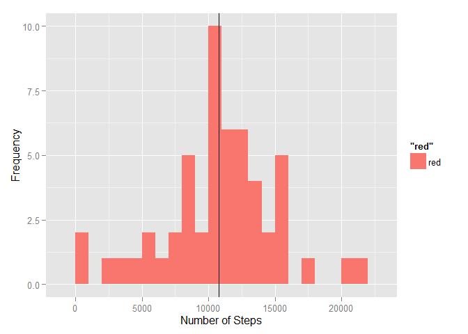
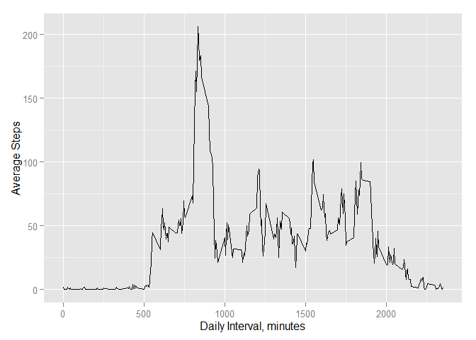
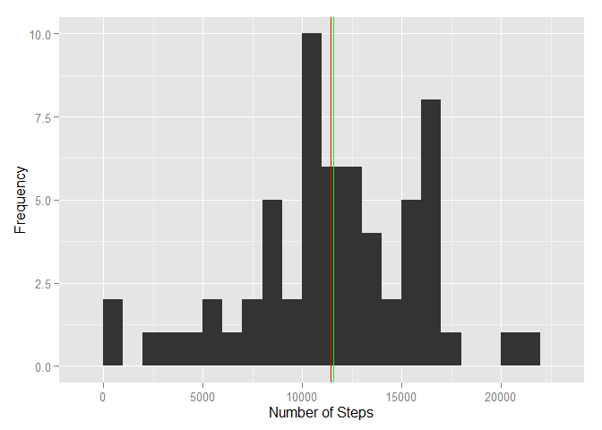
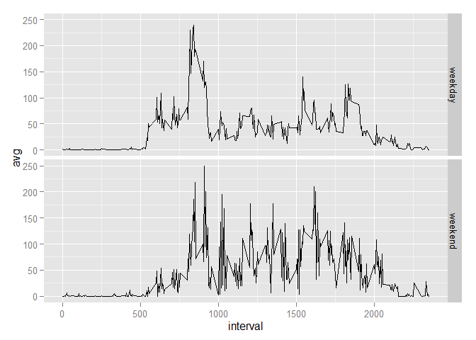

# Reproducible Research: Peer Assessment 1
##Submitted by maander6, Sat Jul 18 20:06:31 2015
Data  (activity.csv) for this analysis is provided by the Reproducible Research 
Coursera Course Instructors.  It is placed in the working directory for the 
analysis.

## Loading and preprocessing the data

Libraries dplyr and ggplot2 are required for the analysis


```r
  library(dplyr)
```

```
## 
## Attaching package: 'dplyr'
## 
## The following object is masked from 'package:stats':
## 
##     filter
## 
## The following objects are masked from 'package:base':
## 
##     intersect, setdiff, setequal, union
```

```r
  library(ggplot2)
```

```
## Warning: package 'ggplot2' was built under R version 3.1.3
```

Data is loaded using the read.csv() function, and then converted to a table.
The type of data in each column is converted to date format (date column) or 
numeric format (steps column) to allow for subsequent processing


```r
# Read the data and convert to a data table.  Once converted, change the date
# column to date format, and the steps column to numeric format

  temp <- read.csv("activity.csv")
  data <- tbl_df(temp)
  data$date <- as.Date(data$date, "%Y-%m-%d")
  data$steps <- as.numeric(data$steps)
```


## What is mean total number of steps taken per day?

Subset the data by selecting only those rows that do not have NA for
the number of steps in the interval.  Once the data has been subsetted,
group the data by date and calculate the total number of steps, the average
number of steps, and the median number of steps for each date.


```r
  df <- subset(data, !is.na(data$steps))
  avg.step <- df %>% group_by(date) %>% summarize(total=sum(steps))
  avg <- mean(avg.step$total)
  mdn <- median(avg.step$total)
```

The mean number of steps taken is 10766.19 and the median number of steps each 
day is 10765

A Histogram is created to display the distribution of total steps taken on any given
day from October and November of 2012.  The data is binned in groups of 
1000 steps, and the histogram has the mean of the daily steps superimposed with the 
vertical black line.


```r
  qplot(avg.step$total, binwidth=1000, fill="red") + 
          geom_vline(xintercept=avg, color="black") +
          xlab("Number of Steps") +
          ylab("Frequency")
```

 

## What is the average daily activity pattern?
Grouping the activity data by the interval allows the analysis to evaluate the
average activity pattern throughout the day.  This pattern for October and 
November is shown in the following line graph.


```r
  avg.interval <- df %>% group_by(interval) %>% summarize(avg = mean(steps),
     stdev = sd(steps))
  qplot(avg.interval$interval, avg.interval$avg, data=avg.interval, geom="line") +
    xlab("Daily Interval, minutes") +
    ylab("Average Steps")
```

 

From this data, the interval with the highest daily activity can be determined.


```r
   maxint <- avg.interval$interval[which(avg.interval$avg == max(avg.interval$avg))]
   maxint
```

```
## [1] 835
```
The interval with the highest average activity (measured in steps) is at
835 minutes.

## Imputing missing values
In this section the the number of missing values in the activity data set is
calculated and the missing values are replaced.  The missing values are replaced
by generating a random number from a normal distribution calculated using the
mean and standard deviation of the number of steps for that interval (calculated 
previously).  If the random number generated by the normal distribution is
negative, a value of 0 steps is recorded for that interval.


```r
# Calculate the number of missing rows of data
  df.missing <- subset(data, is.na(data$steps))
  missing <- nrow(df.missing)
```

There are 2304 missing values in the activity data set.


```r
# impute function takes 2 data tables, one (df) is a data table that has all the 
# missing step values (NA), and the other (df1) is a data table that contains
# the statistics for the activity for each 5-minute interval during any day.
  impute <- function(df, df1){
    num <- nrow(df1)
# seed the random number generator so that the same random values are
# calculated for each normal distribution
    set.seed(1)
    for (i in 1:num){
      val <- round(rnorm(1, df1$avg[i], df1$stdev[i]))
      if (val < 0){
        val <- 0
      } 
    df$steps[which(df$interval == df1$interval[i])] <- val
  }
  df
}
  
  df.replaced <- impute(df.missing, avg.interval)
  data1 <- arrange(rbind(df, df.replaced), date, interval)
  data1
```

```
## Source: local data frame [17,568 x 3]
## 
##    steps       date interval
## 1      0 2012-10-01        0
## 2      1 2012-10-01        5
## 3      0 2012-10-01       10
## 4      2 2012-10-01       15
## 5      0 2012-10-01       20
## 6      0 2012-10-01       25
## 7      2 2012-10-01       30
## 8      6 2012-10-01       35
## 9      0 2012-10-01       40
## 10     7 2012-10-01       45
## ..   ...        ...      ...
```

```r
  avg.step.cor <- data1 %>% group_by(date) %>% summarize(total=sum(steps))
  avg1 <- mean(avg.step.cor$total)
  mdn1 <- median(avg.step.cor$total)
```

After imputing the data set to add values where NA had previously been reported,
it is found that the average daily activity is 11576.66, and the median 
daily activity is 11458.  Not unexpectedly, since we added steps to
to the activity data set, the average daily activity increased by 810.4671,
and the median daily activity increased by 693.


```r
  qplot(avg.step.cor$total, binwidth=1000) + 
          geom_vline(xintercept=avg1, color="green") +
          geom_vline(xintercept=mdn1, color="red") +
          xlab("Number of Steps") +
          ylab("Frequency")
```

 

A histogram is created using the imputed data.  Vertical lines are superimposed
on the histogram to show the mean number of steps for the imputed
distribution (green) and the median number of steps for the imputed
distribution (red).


## Are there differences in activity patterns between weekdays and weekends?
Using the weekday() function, the day of the week can be added to the activity data.


```r
  dayofweek <- weekdays(data1$date)
  data1 <- cbind(data1, dayofweek)
```

Using this data, we can subset the activity data based on weekday or weekend.
This allows one to compare the daily activity at 5-minute intervals to see if
there are differences in the activity pattern for weekdays and weekend days.


```r
## subset the data by day of week, then add a column identifying weekend 
## or weekday
  weekday <- subset(data1, data1$dayofweek != c("Saturday", "Sunday"))
  weekday <- mutate(weekday, DorE="weekday")
  weekend <- subset(data1, data1$dayofweek == c("Saturday", "Sunday"))
  weekend <- mutate(weekend, DorE="weekend")
## recombine the weekend and weekday data into a single table, and group the
## data by weekend/weekday then by interval
  data2 <- arrange(rbind(weekday, weekend), date, interval)
  data2 <- data2 %>% group_by(DorE, interval) %>% summarize(avg=mean(steps))
```


```r
## plot the data with 2 facets corresponding to the activity for (1)
## weekdays, and (2) weekends
  ggplot(data2, aes(x=interval, y=avg)) + 
        geom_line() + 
        facet_grid(DorE ~ .)
```

 

Clearly there is a difference in the activity pattern depending on whether the
data corresponds to a weekday, or to a weekend

